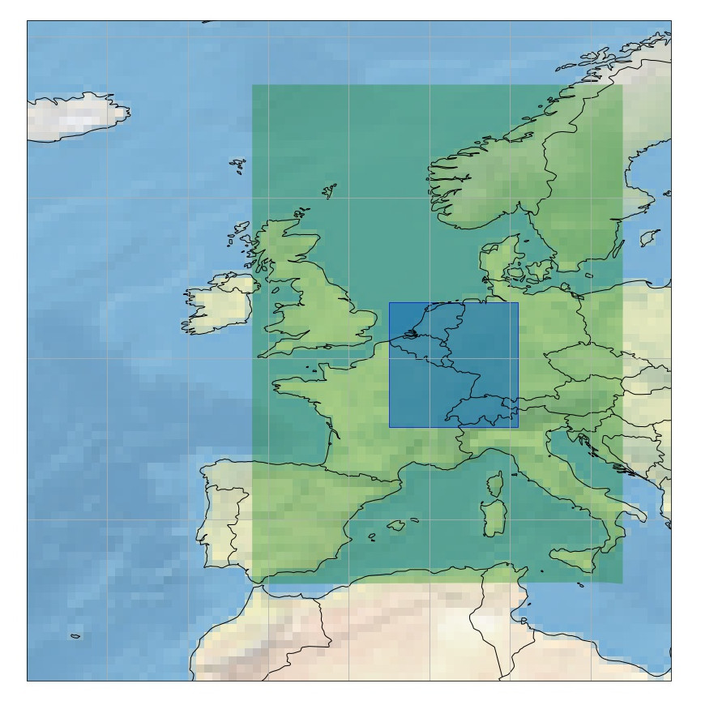
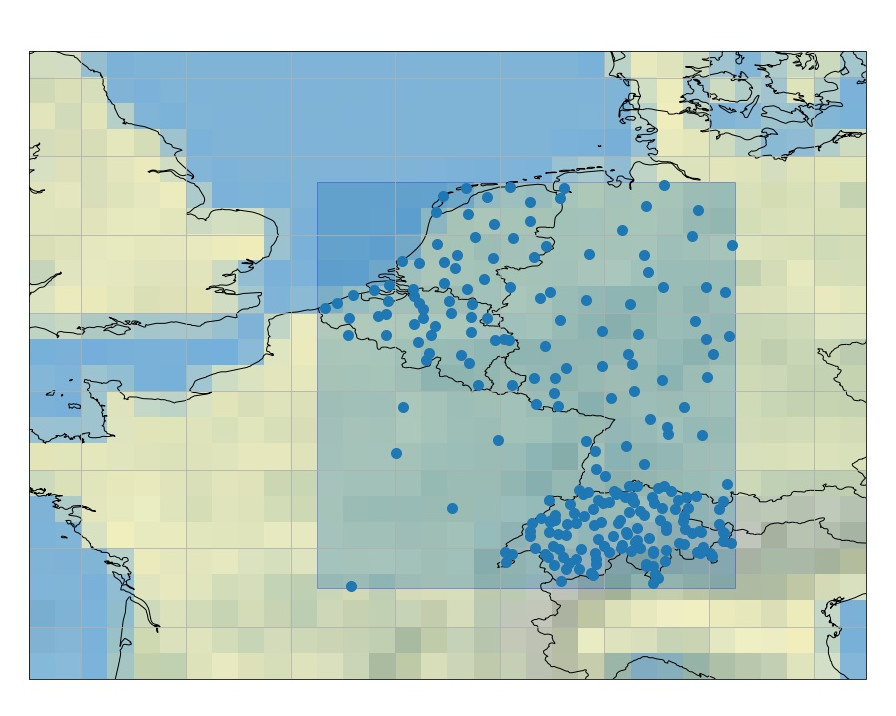

EUPPBench datasets
==================

The *EUPPBench* datasets are available on a small portion of Europe stored in `Zarr <https://zarr.readthedocs.io/en/stable/>`_
format for an easy access allowing for slicing.
The forecasts and observations datasets are already paired together, providing analysis-ready data
for postprocessing benchmarking purposes.

Datasets description
--------------------

There are two main datasets:

1 - Gridded Data
----------------

A forecasts and observations dataset on a regular latitude-longitude grid.

    In blue, the EUPPBench dataset domain inside the :ref:`files/base_datasets:Base datasets over Europe's domain`.

-  The gridded EUPPBench postprocessing benchmark dataset contains
   `ECMWF`_ ensemble and deterministic
   forecasts over a small domain in Europe, from 45.75° to 53.5° in latitude, and from 2.5° to 10.5° in longitude,
   and covers the years 2017-2018.
-  It also contains the corresponding ERA5 reanalysis for the purpose of
   providing observations for the benchmark.
-  For some dates, it contains also `reforecasts`_ that covers 20 years of
   past forecasts recomputed with the most recent model version at the given date.
-  All the forecasts and reforecasts provided are the noon ECMWF runs.
-  The ensemble forecasts and reforecasts also contain by default the
   control run (the 0-th member).
-  The gridded data resolution is 0.25° x 0.25° which corresponds
   roughly to 25 kilometers.
-  Forecasts and reforecasts are 6-hourly, and include the analysis at 00Z.

There are 8 gridded sub-datasets:

1.1 - Extreme Forecast Index
~~~~~~~~~~~~~~~~~~~~~~~~~~~~

All the `Extreme Forecast
Index <https://www.ecmwf.int/assets/elearning/efi/efi1/story_html5.html>`__
(EFI) variables can be obtained for each forecast date.

It includes:

+----------------------------------------------+-----------+---------+
| Parameter name                               | ECMWF key | Remarks |
+==============================================+===========+=========+
| `2 metre temperature                         | 2ti       |         |
| efi <https://apps.                           |           |         |
| ecmwf.int/codes/grib/param-db/?id=132167>`__ |           |         |
+----------------------------------------------+-----------+---------+
| `10 metre wind speed                         | 10wsi     |         |
| efi <https://apps.                           |           |         |
| ecmwf.int/codes/grib/param-db/?id=132165>`__ |           |         |
+----------------------------------------------+-----------+---------+
| `10 metre wind gust                          | 10fgi     |         |
| efi <https://apps.                           |           |         |
| ecmwf.int/codes/grib/param-db/?id=132049>`__ |           |         |
+----------------------------------------------+-----------+---------+
| `cape                                        | capei     |         |
| efi <https://apps.                           |           |         |
| ecmwf.int/codes/grib/param-db/?id=132059>`__ |           |         |
+----------------------------------------------+-----------+---------+
| `cape shear                                  | capesi    |         |
| efi <https://apps.                           |           |         |
| ecmwf.int/codes/grib/param-db/?id=132044>`__ |           |         |
+----------------------------------------------+-----------+---------+
| `Maximum temperature at 2m                   | mx2ti     |         |
| efi <https://apps.                           |           |         |
| ecmwf.int/codes/grib/param-db/?id=132201>`__ |           |         |
+----------------------------------------------+-----------+---------+
| `Minimum temperature at 2m                   | mn2ti     |         |
| efi <https://apps.                           |           |         |
| ecmwf.int/codes/grib/param-db/?id=132202>`__ |           |         |
+----------------------------------------------+-----------+---------+
| `Snowfall                                    | sfi       |         |
| efi <https://apps.                           |           |         |
| ecmwf.int/codes/grib/param-db/?id=132144>`__ |           |         |
+----------------------------------------------+-----------+---------+
| `Total precipitation                         | tpi       |         |
| efi <https://apps.                           |           |         |
| ecmwf.int/codes/grib/param-db/?id=132228>`__ |           |         |
+----------------------------------------------+-----------+---------+

The EFI are available for the model step ranges (in hours) 0-24, 24-48,
48-72, 72-96, 96-120.

**Usage:** The EFI variables can be retrieved by calling

.. code:: python

   ds = cml.load_dataset('EUPPBench-training-data-gridded-forecasts-efi')
   ds.to_xarray()

**Example:**

.. jupyter-execute::

   import climetlab as cml
   ds = cml.load_dataset('EUPPBench-training-data-gridded-forecasts-efi')
   ds.to_xarray()

.. note::

   By definition, observations are not available for Extreme Forecast
   Indices (EFI).

1.2 - Surface variable forecasts
~~~~~~~~~~~~~~~~~~~~~~~~~~~~~~~~

The surface variables can be obtained for each forecast date, both for
the ensemble (51 members) and deterministic runs.

It includes:

+---------------------------+-----------+---------------------------+
| Parameter name            | ECMWF key | Remarks                   |
+===========================+===========+===========================+
| `2 metre                  | 2t/t2m    |                           |
| temperature <http         |           |                           |
| s://apps.ecmwf.int/codes/ |           |                           |
| grib/param-db/?id=167>`__ |           |                           |
+---------------------------+-----------+---------------------------+
| `10 metre U wind          | 10u       |                           |
| component <http           |           |                           |
| s://apps.ecmwf.int/codes/ |           |                           |
| grib/param-db/?id=165>`__ |           |                           |
+---------------------------+-----------+---------------------------+
| `10 metre V wind          | 10v       |                           |
| component <http           |           |                           |
| s://apps.ecmwf.int/codes/ |           |                           |
| grib/param-db/?id=166>`__ |           |                           |
+---------------------------+-----------+---------------------------+
| `Total cloud              | tcc       |                           |
| cover <http               |           |                           |
| s://apps.ecmwf.int/codes/ |           |                           |
| grib/param-db/?id=164>`__ |           |                           |
+---------------------------+-----------+---------------------------+
| `100 metre U wind         | 100u      | Observations not          |
| component  <https:/       |           | available                 |
| /apps.ecmwf.int/codes/gri |           |                           |
| b/param-db/?id=228246>`__ |           |                           |
+---------------------------+-----------+---------------------------+
| `100 metre V wind         | 100v      | Observations not          |
| component  <https:/       |           | available                 |
| /apps.ecmwf.int/codes/gri |           |                           |
| b/param-db/?id=228247>`__ |           |                           |
+---------------------------+-----------+---------------------------+
| `Convective available     | cape      |                           |
| potential                 |           |                           |
| energy <htt               |           |                           |
| ps://apps.ecmwf.int/codes |           |                           |
| /grib/param-db/?id=59>`__ |           |                           |
+---------------------------+-----------+---------------------------+
| `Soil temperature level   | stl1      |                           |
| 1 <http                   |           |                           |
| s://apps.ecmwf.int/codes/ |           |                           |
| grib/param-db/?id=139>`__ |           |                           |
+---------------------------+-----------+---------------------------+
| `Total column             | tcw       |                           |
| water <http               |           |                           |
| s://apps.ecmwf.int/codes/ |           |                           |
| grib/param-db/?id=136>`__ |           |                           |
+---------------------------+-----------+---------------------------+
| `Total column water       | tcwv      |                           |
| vapour <http              |           |                           |
| s://apps.ecmwf.int/codes/ |           |                           |
| grib/param-db/?id=137>`__ |           |                           |
+---------------------------+-----------+---------------------------+
| `Volumetric soil water    | swvl1     |                           |
| layer                     |           |                           |
| 1 <htt                    |           |                           |
| ps://apps.ecmwf.int/codes |           |                           |
| /grib/param-db/?id=39>`__ |           |                           |
+---------------------------+-----------+---------------------------+
| `Snow                     | sd        |                           |
| depth <http               |           |                           |
| s://apps.ecmwf.int/codes/ |           |                           |
| grib/param-db/?id=141>`__ |           |                           |
+---------------------------+-----------+---------------------------+
| `Convective               | cin       | Observations not          |
| inhibition <https:/       |           | available                 |
| /apps.ecmwf.int/codes/gri |           |                           |
| b/param-db/?id=228001>`__ |           |                           |
+---------------------------+-----------+---------------------------+
| `Visibility <https        | vis       | Observations not          |
| ://apps.ecmwf.int/codes/g |           | available                 |
| rib/param-db/?id=3020>`__ |           |                           |
+---------------------------+-----------+---------------------------+

Some missing observations will become available later.

**Usage:** The surface variables forecasts can be retrieved by calling

.. code:: python

   ds = cml.load_dataset('EUPPBench-training-data-gridded-forecasts-surface', kind)
   ds.to_xarray()

where the ``kind`` argument allows to select the
deterministic or ensemble forecasts, by setting it to ``'highres'`` or
``'ensemble'``.

**Example:**

.. jupyter-execute::

   ds = cml.load_dataset('EUPPBench-training-data-gridded-forecasts-surface', "highres")
   ds.to_xarray()

1.3 - Pressure level variable forecasts
~~~~~~~~~~~~~~~~~~~~~~~~~~~~~~~~~~~~~~~

The variables on pressure level can be obtained for each forecast date,
both for the ensemble (51 members) and deterministic runs.

It includes:

+-------------------------------------+-------+-----------+---------+
| Parameter name                      | Level | ECMWF key | Remarks |
+=====================================+=======+===========+=========+
| `Temperature <https://apps.ecmwf.   | 850   | t         |         |
| int/codes/grib/param-db/?id=130>`__ |       |           |         |
+-------------------------------------+-------+-----------+---------+
| `U component of                     | 700   | u         |         |
| wind <https://apps.ecmwf.           |       |           |         |
| int/codes/grib/param-db/?id=131>`__ |       |           |         |
+-------------------------------------+-------+-----------+---------+
| `V component of                     | 700   | v         |         |
| wind <https://apps.ecmwf.           |       |           |         |
| int/codes/grib/param-db/?id=132>`__ |       |           |         |
+-------------------------------------+-------+-----------+---------+
| `Geopotential <https://apps.ecmwf.  | 500   | z         |         |
| int/codes/grib/param-db/?id=129>`__ |       |           |         |
+-------------------------------------+-------+-----------+---------+
| `Specific                           | 700   | q         |         |
| humidity <https://apps.ecmwf.       |       |           |         |
| int/codes/grib/param-db/?id=133>`__ |       |           |         |
+-------------------------------------+-------+-----------+---------+
| `Relative                           | 850   | r         |         |
| humidity <https://apps.ecmwf.       |       |           |         |
| int/codes/grib/param-db/?id=157>`__ |       |           |         |
+-------------------------------------+-------+-----------+---------+

**Usage:** The pressure level variables forecasts can be retrieved by
calling

.. code:: python

   ds = cml.load_dataset('eumetnet-postprocessing-benchmark-EUPP-training-data-gridded-forecasts-pressure', level, kind)
   ds.to_xarray()

where the ``level`` argument is the pressure level, as a string or an integer. The ``kind`` argument
allows to select the deterministic or ensemble forecasts, by setting it
to ``'highres'`` or ``'ensemble'``.

**Example:**

.. jupyter-execute::

   ds = cml.load_dataset('EUPPBench-training-data-gridded-forecasts-pressure', 500, "highres")
   ds.to_xarray()

1.4 - Processed surface variable forecasts
~~~~~~~~~~~~~~~~~~~~~~~~~~~~~~~~~~~~~~~~~~~~~~

Processed surface variables can be obtained for each forecast date,
both for the ensemble (51 members) and deterministic runs. A
processed variable is either accumulated, averaged or filtered.

It includes:

+----------------------------------------------+-----------+---------+
| Parameter name                               | ECMWF key | Remarks |
+==============================================+===========+=========+
| `Total                                       | tp6       |         |
| precipitation <https://ap                    |           |         |
| ps.ecmwf.int/codes/grib/param-db/?id=228>`__ |           |         |
+----------------------------------------------+-----------+---------+
| `Surface sensible heat                       | sshf6     |         |
| flux <https://ap                             |           |         |
| ps.ecmwf.int/codes/grib/param-db/?id=146>`__ |           |         |
+----------------------------------------------+-----------+---------+
| `Surface latent heat                         | slhf6     |         |
| flux <https://ap                             |           |         |
| ps.ecmwf.int/codes/grib/param-db/?id=147>`__ |           |         |
+----------------------------------------------+-----------+---------+
| `Surface net solar                           | ssr6      |         |
| radiation <https://ap                        |           |         |
| ps.ecmwf.int/codes/grib/param-db/?id=176>`__ |           |         |
+----------------------------------------------+-----------+---------+
| `Surface net thermal                         | str6      |         |
| radiation <https://ap                        |           |         |
| ps.ecmwf.int/codes/grib/param-db/?id=177>`__ |           |         |
+----------------------------------------------+-----------+---------+
| `Convective                                  | cp6       |         |
| precipitation <https://ap                    |           |         |
| ps.ecmwf.int/codes/grib/param-db/?id=143>`__ |           |         |
+----------------------------------------------+-----------+---------+
| `Maximum temperature at 2                    | mx2t6     |         |
| metres <https://ap                           |           |         |
| ps.ecmwf.int/codes/grib/param-db/?id=121>`__ |           |         |
+----------------------------------------------+-----------+---------+
| `Minimum temperature at 2                    | mn2t6     |         |
| metres <https://ap                           |           |         |
| ps.ecmwf.int/codes/grib/param-db/?id=122>`__ |           |         |
+----------------------------------------------+-----------+---------+
| `Surface solar radiation                     | ssrd6     |         |
| downwards <https://ap                        |           |         |
| ps.ecmwf.int/codes/grib/param-db/?id=169>`__ |           |         |
+----------------------------------------------+-----------+---------+
| `Surface thermal radiation                   | strd6     |         |
| downwards <https://ap                        |           |         |
| ps.ecmwf.int/codes/grib/param-db/?id=175>`__ |           |         |
+----------------------------------------------+-----------+---------+
| `10 metre wind                               | 10fg6     |         |
| gust <https://ap                             |           |         |
| ps.ecmwf.int/codes/grib/param-db/?id=123>`__ |           |         |
+----------------------------------------------+-----------+---------+

All these variables are accumulated or filtered over the last 6 hours
preceding a given forecast timestamp. As a consequence, a `6' was added to the ECMWF key to denote this.

**Usage:** The processed surface variables forecasts can be retrieved by calling

.. code:: python

   ds = cml.load_dataset('EUPPBench-training-data-gridded-forecasts-surface-processed', kind)
   ds.to_xarray()

where the ``kind`` argument allows to select the deterministic or ensemble forecasts, by setting it to ``'highres'`` or
``'ensemble'``.

**Example:**

.. jupyter-execute::

   ds = cml.load_dataset('EUPPBench-training-data-gridded-forecasts-surface-processed', "highres")
   ds.to_xarray()

1.5 - Surface variable reforecasts
~~~~~~~~~~~~~~~~~~~~~~~~~~~~~~~~~~

The surface variables for the ensemble reforecasts (11 members) can be
obtained for each reforecast date. All the variables described at in the section :ref:`files/EUPPBench_datasets:1.2 - Surface variable forecasts`
above are available.

.. note::

   The ECMWF reforecasts are only available on dates corresponding to Mondays and
   Thursdays.

**Usage:** The surface variables reforecasts can be retrieved by calling

.. code:: python

   ds = cml.load_dataset('EUPPBench-training-data-gridded-reforecasts-surface')
   ds.to_xarray()

**Example:**

.. jupyter-execute::

   ds = cml.load_dataset('EUPPBench-training-data-gridded-reforecasts-surface')
   ds.to_xarray()

1.6 - Pressure level variable reforecasts
~~~~~~~~~~~~~~~~~~~~~~~~~~~~~~~~~~~~~~~~~

The variables on pressure level for the ensemble reforecasts (11
members) can be obtained for each reforecast date. All the variables
described in the section :ref:`files/EUPPBench_datasets:1.3 - Pressure level variable forecasts` above are available.

.. note::

   The ECMWF reforecasts are only available on dates corresponding to Mondays and
   Thursdays.

**Usage:** The pressure level variables reforecasts can be retrieved by
calling

.. code:: python

   ds = cml.load_dataset('EUPPBench-training-data-gridded-reforecasts-pressure', level)
   ds.to_xarray()

The ``level`` argument is the pressure level, as a string or an integer.

**Example:**

.. jupyter-execute::

   ds = cml.load_dataset('EUPPBench-training-data-gridded-reforecasts-pressure', 500)
   ds.to_xarray()

1.7 - Processed surface variable reforecasts
~~~~~~~~~~~~~~~~~~~~~~~~~~~~~~~~~~~~~~~~~~~~~~~~

Processed surface variables as described in section :ref:`files/EUPPBench_datasets:1.4 - Processed surface variable forecasts`
can also be obtained as ensemble reforecasts (11 members).

.. note::

   The ECMWF reforecasts are only available on dates corresponding to Mondays and
   Thursdays.

**Usage:** The surface variables forecasts can be retrieved by calling

.. code:: python

   ds = cml.load_dataset('EUPPBench-training-data-gridded-reforecasts-surface-processed')
   ds.to_xarray()

**Example:**

.. jupyter-execute::

   ds = cml.load_dataset('EUPPBench-training-data-gridded-reforecasts-surface-processed')
   ds.to_xarray()

1.8 - Static fields
~~~~~~~~~~~~~~~~~~~

Various static fields associated to the forecast grid can be obtained,
with the purpose of serving as predictors for the postprocessing.

.. note::

   For consistency with the rest of the dataset, we use the
   ECMWF parameters name, terminology and units here. However, please
   note that - except for the Surface Geopotential - the fields provided are from other non-ECMWF data sources
   evaluated at grid points. Currently, the main data source being used
   is the `Copernicus Land Monitoring
   Service <https://land.copernicus.eu/>`__.

It includes:

+---------------------------------------------------------------------------------+-----------+-------------------------------------------------------------------------------------------------------------+
| Parameter name                                                                  | ECMWF key | Remarks                                                                                                     |
+=================================================================================+===========+=============================================================================================================+
| `Land use <https://apps.ecmwf.int/codes/grib/param-db/?id=260184>`_             | landu     | Extracted from the `CORINE 2018`_ dataset.                                                                  |
|                                                                                 |           | Values and associated land type differ from the ECMWF one.                                                  |
|                                                                                 |           | Please look at the “legend” entry in the metadata for more details.                                         |
+---------------------------------------------------------------------------------+-----------+-------------------------------------------------------------------------------------------------------------+
| `Model terrain height <https://apps.ecmwf.int/codes/grib/param-db/?id=260183>`_ | mterh     | Extracted from the `EU-DEMv1.1 <https://land.copernicus.eu/imagery-in-situ/eu-dem>`__ data elevation model  |
|                                                                                 |           | dataset.                                                                                                    |
+---------------------------------------------------------------------------------+-----------+-------------------------------------------------------------------------------------------------------------+
| `Surface Geopotential <https://apps.ecmwf.int/codes/grib/param-db/?id=129>`_    | z         | The model orography can be obtained by dividing the surface geopotential by g=9.80665 ms :math:`{}^{-2}`.   |
+---------------------------------------------------------------------------------+-----------+-------------------------------------------------------------------------------------------------------------+

**Usage:** The static fields can be retrieved by calling

.. code:: python

   ds = cml.load_dataset('EUPPBench-training-data-gridded-static-fields', parameter)
   ds.to_xarray()

where the ``parameter`` argument is a string with one of the ECMWF keys
described above. It is only possible to download one static field per
call.

**Example:**

.. jupyter-execute::

   ds = cml.load_dataset('EUPPBench-training-data-gridded-static-fields', 'mterh')
   ds.to_xarray()

2 - Stations Data
-----------------

A dataset similar to the gridded one, but with station observations.

    The stations included in the EUPPBench dataset.

.. TODO complete the list below

-  The stations EUPPBench postprocessing benchmark dataset contains
   `ECMWF <https://www.ecmwf.int/>`__ ensemble and deterministic
   forecasts at the grid point closest to the station locations, and covers the years 2017-2018.
-  It also contains the corresponding stations observations.
-  For some dates, it contains also `reforecasts`_ that covers 20 years of
   past forecasts recomputed with the most recent model version at the given date.
-  All the forecasts and reforecasts provided are the noon ECMWF runs.
-  The ensemble forecasts and reforecasts also contain by default the
   control run (the 0-th member).
-  5 countries are presently available: Belgium, Austria, France, Germany, The Netherlands.

There are 7 stations sub-datasets:

2.1 - Extreme Forecast Index
~~~~~~~~~~~~~~~~~~~~~~~~~~~~

All the `Extreme Forecast
Index <https://www.ecmwf.int/assets/elearning/efi/efi1/story_html5.html>`__
(EFI) variables can be obtained for each forecast date.

The same variables as in section :ref:`files/EUPPBench_datasets:1.1 - Extreme Forecast Index` are available.

The EFI are available for the model step ranges (in hours) 0-24, 24-48,
48-72, 72-96, 96-120.

**Usage:** The EFI variables can be retrieved by calling

.. code:: python

   ds = cml.load_dataset('EUPPBench-training-data-stations-forecasts-efi', country)
   ds.to_xarray()

where the ``country`` argument must be chosen amongst the list [``belgium``, ``austria``, ``france``, ``germany``, ``netherlands``].

**Example:**

.. jupyter-execute::

   import climetlab as cml
   ds = cml.load_dataset('EUPPBench-training-data-stations-forecasts-efi', 'austria')
   ds.to_xarray()

.. note::

   By definition, observations are not available for Extreme Forecast
   Indices (EFI).

2.2 - Surface variable forecasts
~~~~~~~~~~~~~~~~~~~~~~~~~~~~~~~~

The surface variables can be obtained for each forecast date, both for
the ensemble (51 members) and deterministic runs.

The same variables as in section :ref:`files/EUPPBench_datasets:1.2 - Surface variable forecasts` are available.

.. note::

   Only the variables ``t2m``, ``vis`` and ``tcc`` have presently station observations.

**Usage:** The surface variables forecasts can be retrieved by calling

.. code:: python

   ds = cml.load_dataset('EUPPBench-training-data-stations-forecasts-surface', kind, country)
   ds.to_xarray()

where the ``kind`` argument allows to select the
deterministic or ensemble forecasts, by setting it to ``'highres'`` or
``'ensemble'``.
The ``country`` argument must be chosen amongst the list [``belgium``, ``austria``, ``france``, ``germany``, ``netherlands``].

**Example:**

.. jupyter-execute::

   ds = cml.load_dataset('EUPPBench-training-data-stations-forecasts-surface', "highres", "austria")
   ds.to_xarray()

2.3 - Pressure level variable forecasts
~~~~~~~~~~~~~~~~~~~~~~~~~~~~~~~~~~~~~~~

The variables on pressure level can be obtained for each forecast date,
both for the ensemble (51 members) and deterministic runs.

The same variables as in section :ref:`files/EUPPBench_datasets:2.3 - Pressure level variable forecasts` are available.

.. note::

   For obvious reasons, station observations are not available on pressure levels.

**Usage:** The pressure level variables forecasts can be retrieved by
calling

.. code:: python

   ds = cml.load_dataset('eumetnet-postprocessing-benchmark-EUPP-training-data-stations-forecasts-pressure', level, kind, country)
   ds.to_xarray()

where the ``level`` argument is the pressure level, as a string or an integer. The ``kind`` argument
allows to select the deterministic or ensemble forecasts, by setting it
to ``'highres'`` or ``'ensemble'``.
The ``country`` argument must be chosen amongst the list [``belgium``, ``austria``, ``france``, ``germany``, ``netherlands``].

**Example:**

.. jupyter-execute::

   ds = cml.load_dataset('EUPPBench-training-data-stations-forecasts-pressure', 500, "highres", "austria")
   ds.to_xarray()

2.4 - Processed surface variable forecasts
~~~~~~~~~~~~~~~~~~~~~~~~~~~~~~~~~~~~~~~~~~~~~~

Processed surface variables can be obtained for each forecast date,
both for the ensemble (51 members) and deterministic runs. A
processed variable is either accumulated, averaged or filtered.

The same variables as in section :ref:`files/EUPPBench_datasets:2.4 - Processed surface variable forecasts` are available.

.. note::

   Only the variables ``tp6`` and ``10fg6`` have presently station observations.

**Usage:** The processed surface variables forecasts can be retrieved by calling

.. code:: python

   ds = cml.load_dataset('EUPPBench-training-data-stations-forecasts-surface-processed', kind, country)
   ds.to_xarray()

where the ``kind`` argument allows to select the deterministic or ensemble forecasts, by setting it to ``'highres'`` or
``'ensemble'``.
The ``country`` argument must be chosen amongst the list [``belgium``, ``austria``, ``france``, ``germany``, ``netherlands``].

**Example:**

.. jupyter-execute::

   ds = cml.load_dataset('EUPPBench-training-data-stations-forecasts-surface-processed', "highres", "austria")
   ds.to_xarray()

2.5 - Surface variable reforecasts
~~~~~~~~~~~~~~~~~~~~~~~~~~~~~~~~~~

The surface variables for the ensemble reforecasts (11 members) can be
obtained for each reforecast date. All the variables described at in the section :ref:`files/EUPPBench_datasets:1.2 - Surface variable forecasts`
above are available.

.. note::

   The ECMWF reforecasts are only available on dates corresponding to Mondays and
   Thursdays.

.. note::

   Only the variables ``t2m``, ``vis`` and ``tcc`` have presently station observations.

**Usage:** The surface variables reforecasts can be retrieved by calling

.. code:: python

   ds = cml.load_dataset('EUPPBench-training-data-stations-reforecasts-surface', country)
   ds.to_xarray()

where the ``country`` argument must be chosen amongst the list [``belgium``, ``austria``, ``france``, ``germany``, ``netherlands``].

**Example:**

.. jupyter-execute::

   ds = cml.load_dataset('EUPPBench-training-data-stations-reforecasts-surface', "austria")
   ds.to_xarray()

2.6 - Pressure level variable reforecasts
~~~~~~~~~~~~~~~~~~~~~~~~~~~~~~~~~~~~~~~~~

The variables on pressure level for the ensemble reforecasts (11
members) can be obtained for each reforecast date. All the variables
described in the section :ref:`files/EUPPBench_datasets:1.3 - Pressure level variable forecasts` above are available.

.. note::

   The ECMWF reforecasts are only available on dates corresponding to Mondays and
   Thursdays.

.. note::

   For obvious reasons, station observations are not available on pressure levels.

**Usage:** The pressure level variables reforecasts can be retrieved by
calling

.. code:: python

   ds = cml.load_dataset('EUPPBench-training-data-stations-reforecasts-pressure', level, country)
   ds.to_xarray()

The ``level`` argument is the pressure level, as a string or an integer.
The ``country`` argument must be chosen amongst the list [``belgium``, ``austria``, ``france``, ``germany``, ``netherlands``].

**Example:**

.. jupyter-execute::

   ds = cml.load_dataset('EUPPBench-training-data-stations-reforecasts-pressure', 500, "austria")
   ds.to_xarray()

2.7 - Processed surface variable reforecasts
~~~~~~~~~~~~~~~~~~~~~~~~~~~~~~~~~~~~~~~~~~~~

Processed surface variables as described in section :ref:`files/EUPPBench_datasets:1.4 - Processed surface variable forecasts`
can also be obtained as ensemble reforecasts (11 members).

.. note::

   The ECMWF reforecasts are only available on dates corresponding to Mondays and
   Thursdays.

.. note::

   Only the variables ``tp6`` and ``10fg6`` have presently station observations.

**Usage:** The surface variables forecasts can be retrieved by calling

.. code:: python

   ds = cml.load_dataset('EUPPBench-training-data-stations-reforecasts-surface-processed', country)
   ds.to_xarray()

The ``country`` argument must be chosen amongst the list [``belgium``, ``austria``, ``france``, ``germany``, ``netherlands``].

**Example:**

.. jupyter-execute::

   ds = cml.load_dataset('EUPPBench-training-data-stations-reforecasts-surface-processed', "austria")
   ds.to_xarray()

3 - Getting the observations corresponding to the (re)forecasts
---------------------------------------------------------------

Once obtained, the observations (if available) corresponding to the downloaded forecasts or reforecasts
can be retrieved in the `xarray`_ format by
using the ``get_observations_as_xarray`` method:

.. jupyter-execute::

   ds = cml.load_dataset('EUPPBench-training-data-stations-reforecasts-surface-processed', "austria")
   obs = ds.get_observations_as_xarray()
   obs

4 - Explanation of the metadata
-------------------------------

For all data, attributes specifying the sources and the license are always present.
Depending on the kind of dataset, dimensions and information are embedded in the data as follow:

Gridded data
~~~~~~~~~~~~

The following metadata are available in the gridded forecast, reforecast and observation data:

+-------------------------------------+----------------------------------------------------------------------+
| Metadata                            | Description                                                          |
+=====================================+======================================================================+
|  **latitude**                       | Latitude of the grid points.                                         |
+-------------------------------------+----------------------------------------------------------------------+
|  **longitude**                      | Longitude of the grid points.                                        |
+-------------------------------------+----------------------------------------------------------------------+
|  **depthBelowLandLayer**            | Layer below the surface (valid for some variables only, here there   |
|                                     | is only the upper surface level).                                    |
+-------------------------------------+----------------------------------------------------------------------+
|  **number**                         | Number of the ensemble member. The 0-th member is the control run.   |
|                                     | Also present in observation for compatibility reasons, but set to 0. |
+-------------------------------------+----------------------------------------------------------------------+
|  **time**                           | Forecast or reforecast date (reforecasts are only issued             |
|                                     | on Mondays and Thursdays).                                           |
+-------------------------------------+----------------------------------------------------------------------+
|  **year**                           | Dimension to identify the year in the past, year=1 means a forecast  |
|                                     | valid 20 years ago at the reforecast day and month, year=20 means    |
|                                     | a forecast valid one year before the reforecast date.                |
|                                     | Only valid for reforecasts.                                          |
+-------------------------------------+----------------------------------------------------------------------+
|  **step**                           | Step of the forecast (the lead time).                                |
+-------------------------------------+----------------------------------------------------------------------+
|  **surface**                        | Layer of the variable considered                                     |
|                                     | (here there is just one, at the surface).                            |
+-------------------------------------+----------------------------------------------------------------------+
|   **isobaricInhPa**                 | Pressure level in hectopascal (or millibar).                         |
+-------------------------------------+----------------------------------------------------------------------+
|   valid_time                        | Actual time and date of the corresponding forecast data.             |
+-------------------------------------+----------------------------------------------------------------------+

.. note::

   **Bold** metadata denotes dimensions indexing the datasets.

Stations data
~~~~~~~~~~~~~

For station forecast and reforecast data, the following metadata are available:

+-------------------------------------+----------------------------------------------------------------------+
| Metadata                            | Description                                                          |
+=====================================+======================================================================+
|  station_latitude                   | Latitude of the station.                                             |
+-------------------------------------+----------------------------------------------------------------------+
|  station_longitude                  | Longitude of the station.                                            |
+-------------------------------------+----------------------------------------------------------------------+
|  station_altitude                   | Altitude of the station (in meter).                                  |
+-------------------------------------+----------------------------------------------------------------------+
|  **station_id**                     | Unique identifier of the station.                                    |
+-------------------------------------+----------------------------------------------------------------------+
|  **depthBelowLandLayer**            | Layer below the surface (valid for some variables only, here there   |
|                                     | is only the upper surface level).                                    |
+-------------------------------------+----------------------------------------------------------------------+
|  **number**                         | Number of the ensemble member. The 0-th member is the control run.   |
|                                     | Also present in observation for compatibility reasons, but set to 0. |
+-------------------------------------+----------------------------------------------------------------------+
|  **time**                           | Forecast or reforecast date (reforecasts are only issued             |
|                                     | on Mondays and Thursdays).                                           |
+-------------------------------------+----------------------------------------------------------------------+
|  **year**                           | Dimension to identify the year in the past, year=1 means a forecast  |
|                                     | valid 20 years ago at the reforecast day and month, year=20 means    |
|                                     | a forecast valid one year before the reforecast date.                |
|                                     | Only valid for reforecasts.                                          |
+-------------------------------------+----------------------------------------------------------------------+
|  **step**                           | Step of the forecast (the lead time).                                |
+-------------------------------------+----------------------------------------------------------------------+
|  **surface**                        | Layer of the variable considered                                     |
|                                     | (here there is just one, at the surface).                            |
+-------------------------------------+----------------------------------------------------------------------+
|   **isobaricInhPa**                 | Pressure level in hectopascal (or millibar).                         |
+-------------------------------------+----------------------------------------------------------------------+
|  station_land_usage                 | Land usage at the station location, extracted from the               |
|                                     | `CORINE 2018`_ dataset.                                              |
+-------------------------------------+----------------------------------------------------------------------+
|  station_name                       | Name of the station.                                                 |
+-------------------------------------+----------------------------------------------------------------------+
|  model_latitude                     | Latitude of the model grid point.                                    |
+-------------------------------------+----------------------------------------------------------------------+
|  model_longitude                    | Longitude of the model grid point.                                   |
+-------------------------------------+----------------------------------------------------------------------+
|  model_altitude                     | True altitude (in meter) of the model grid point, extracted from the |
|                                     | `EU-DEMv1.1 <https://land.copernicus.eu/imagery-in-situ/eu-dem>`__   |
|                                     | data elevation model dataset.                                        |
+-------------------------------------+----------------------------------------------------------------------+
|  model_orography                    | Surface height (in meter) in the model at the model grid point.      |
+-------------------------------------+----------------------------------------------------------------------+
|  model_land_usage                   | Land usage at the model grid point, extracted from the               |
|                                     | `CORINE 2018`_ dataset.                                              |
+-------------------------------------+----------------------------------------------------------------------+
|   valid_time                        | Actual time and date of the corresponding forecast data.             |
+-------------------------------------+----------------------------------------------------------------------+

.. note::

   The metadata with `model' in their name indicate properties of the model grid point the closest to the station location, and
   at which the forecasts corresponding to the station observations was extracted from the gridded dataset.

For the station observations, the following metadata are available:

+-------------------------------------+----------------------------------------------------------------------+
| Metadata                            | Description                                                          |
+=====================================+======================================================================+
|  altitude                           | Altitude of the station (in meter).                                  |
+-------------------------------------+----------------------------------------------------------------------+
|  land_usage                         | Land usage at the station location, extracted from the               |
|                                     | `CORINE 2018`_ dataset.                                              |
+-------------------------------------+----------------------------------------------------------------------+
|  latitude                           | Latitude of the station.                                             |
+-------------------------------------+----------------------------------------------------------------------+
|  longitude                          | Longitude of the station.                                            |
+-------------------------------------+----------------------------------------------------------------------+
|  **station_id**                     | Unique identifier of the station.                                    |
+-------------------------------------+----------------------------------------------------------------------+
|  station_name                       | Name of the station.                                                 |
+-------------------------------------+----------------------------------------------------------------------+
|  **step**                           | Step of the forecast (the lead time).                                |
+-------------------------------------+----------------------------------------------------------------------+
|  **time**                           | Forecast or reforecast date (reforecasts are only issued             |
|                                     | on Mondays and Thursdays).                                           |
+-------------------------------------+----------------------------------------------------------------------+

5 - Major ECMWF model changes
-----------------------------

In 2017 and 2018, there were 2 model changes of the ECMWF model on total:

+-------------------------+--------------------------+-----------------+-------------------------------------+
| Implementation date     | Summary of changes       | Resolution      | Full IFS documentation              |
+=========================+==========================+=================+=====================================+
|  05-Jun-2018            | `Cycle 45r1`_            | Unchanged       | `Cycle 45r1 full documentation`_    |
+-------------------------+--------------------------+-----------------+-------------------------------------+
|  11-Jul-17              | `Cycle 43r3`_            | Unchanged       | `Cycle 43r3 full documentation`_    |
+-------------------------+--------------------------+-----------------+-------------------------------------+

Source: `<https://www.ecmwf.int/en/forecasts/documentation-and-support/changes-ecmwf-model>`_

Tips & Tricks
-------------

Saving the data to a NetCDF file
~~~~~~~~~~~~~~~~~~~~~~~~~~~~~~~~

This is particularly useful if one wants to reuse the data with another programming language.
For example, if one has downloaded the observations shown in section :ref:`files/EUPPBench_datasets:3 - Getting the observations corresponding to the (re)forecasts`,
one can save them to disk by using the :meth:`xarray.Dataset.to_netcdf` functionality of the `xarray`_ :class:`~xarray.Dataset`:

.. code:: python

   ds = cml.load_dataset('EUPPBench-training-data-stations-reforecasts-surface-processed', "austria")
   obs = ds.get_observations_as_xarray()
   obs.to_netcdf('austria_reforecasts.nc')

Finding the units of a given data
~~~~~~~~~~~~~~~~~~~~~~~~~~~~~~~~~

In general, we align with the units of the `ECMWF`_ data. You can find the particular units of a given data by clicking on the parameter's name in
the table above. For many variables, the units are also available in the metadata of the forecasts. For example, the following code snippet show how to retrieve the units of
surface variable in the station dataset:

.. jupyter-execute::

   ds = cml.load_dataset('EUPPBench-training-data-stations-reforecasts-surface', "austria")
   fcs = ds.to_xarray()
   fcs.v100.units

Data License
------------

See the
`DATA_LICENSE <https://github.com/Climdyn/climetlab-eumetnet-postprocessing-benchmark/blob/main/DATA_LICENSE>`__ file.

Station observations were provided by European National Meteorological Services within the framework of their open data policy, and are sourced in the metadata of the
corresponding datasets.

Swiss station data are part of this dataset but are presently restricted. These station data may be obtained from `IDAWEB <https://gate.meteoswiss.ch/idaweb/>`_ at MeteoSwiss
and we are not entitled to provide it online. Registration with IDAWEB can be initiated `here <https://gate.meteoswiss.ch/idaweb/prepareRegistration.do>`_.
Please also read `these information <https://gate.meteoswiss.ch/idaweb/more.do?language=en>`_.

.. _reforecasts: https://www.ecmwf.int/en/forecasts/documentation-and-support/extended-range/re-forecast-medium-and-extended-forecast-range
.. _Cycle 45r1: https://www.ecmwf.int/en/forecasts/documentation-and-support/evolution-ifs/cycles/summary-cycle-45r1
.. _Cycle 43r3: https://www.ecmwf.int/en/forecasts/about-our-forecasts/evolution-ifs/cycles/cycle-43r3
.. _Cycle 45r1 full documentation: https://www.ecmwf.int/en/publications/search/?solrsort=sort_label%20asc&secondary_title=%22IFS%20Documentation%20CY45R1%22
.. _Cycle 43r3 full documentation: https://www.ecmwf.int/en/publications/search/?solrsort=sort_label%20asc&secondary_title=%22IFS%20Documentation%20CY43R3%22
.. _xarray: http://xarray.pydata.org/en/stable/index.html
.. _CORINE 2018: https://land.copernicus.eu/pan-european/corine-land-cover
.. _ECMWF: https://www.ecmwf.int/