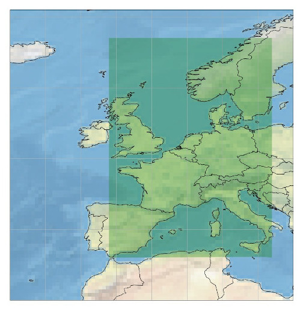

Base datasets over Europe's domain
==================================

These are the global datasets available on a large portion of Europe which constitute the base to develop more specific
benchmark datasets.

.. warning::

    Access to the forecasts and observations is currently time-granular: these datasets cannot be sliced over the issuance time dimension.

Datasets description
--------------------

There are two main datasets:

1 - Gridded Data
----------------

    The global EUMETNET postprocessing benchmark domain.

-  The gridded main Eumetnet postprocessing benchmark dataset contains
   `ECMWF <https://www.ecmwf.int/>`__ ensemble and deterministic
   forecasts over a large portion of Europe, from 36 to 67° in latitude
   and from -6 to 17° of longitude, and covers the years 2017-2018.
-  It also contains the corresponding ERA5 reanalysis for the purpose of
   providing observations for the benchmark.
-  For some dates, it contains also `reforecasts`_ that covers 20 years of
   past forecasts recomputed with the most recent model version.
-  All the forecasts and reforecasts provided are the noon ECMWF runs.
-  The ensemble forecasts and reforecasts also contain by default the
   control run (the 0-th member).
-  The gridded data resolution is 0.25° x 0.25° which corresponds
   roughly to 25 kilometers.
-  **Please note that you can presently only retrieve one forecast
   date** for each ``climetlab.load_dataset`` call.

There are 8 gridded sub-datasets:

1.1 - Extreme Forecast Index
~~~~~~~~~~~~~~~~~~~~~~~~~~~~

All the `Extreme Forecast
Index <https://www.ecmwf.int/assets/elearning/efi/efi1/story_html5.html>`__
(EFI) variables can be obtained for each forecast date.

It includes:

+----------------------------------------------+-----------+---------+
| Parameter name                               | ECMWF key | Remarks |
+==============================================+===========+=========+
| `2 metre temperature                         | 2ti       |         |
| efi <https://apps.                           |           |         |
| ecmwf.int/codes/grib/param-db/?id=132167>`__ |           |         |
+----------------------------------------------+-----------+---------+
| `10 metre wind speed                         | 10wsi     |         |
| efi <https://apps.                           |           |         |
| ecmwf.int/codes/grib/param-db/?id=132165>`__ |           |         |
+----------------------------------------------+-----------+---------+
| `10 metre wind gust                          | 10fgi     |         |
| efi <https://apps.                           |           |         |
| ecmwf.int/codes/grib/param-db/?id=132049>`__ |           |         |
+----------------------------------------------+-----------+---------+
| `cape                                        | capei     |         |
| efi <https://apps.                           |           |         |
| ecmwf.int/codes/grib/param-db/?id=132059>`__ |           |         |
+----------------------------------------------+-----------+---------+
| `cape shear                                  | capesi    |         |
| efi <https://apps.                           |           |         |
| ecmwf.int/codes/grib/param-db/?id=132044>`__ |           |         |
+----------------------------------------------+-----------+---------+
| `Maximum temperature at 2m                   | mx2ti     |         |
| efi <https://apps.                           |           |         |
| ecmwf.int/codes/grib/param-db/?id=132201>`__ |           |         |
+----------------------------------------------+-----------+---------+
| `Minimum temperature at 2m                   | mn2ti     |         |
| efi <https://apps.                           |           |         |
| ecmwf.int/codes/grib/param-db/?id=132202>`__ |           |         |
+----------------------------------------------+-----------+---------+
| `Snowfall                                    | sfi       |         |
| efi <https://apps.                           |           |         |
| ecmwf.int/codes/grib/param-db/?id=132144>`__ |           |         |
+----------------------------------------------+-----------+---------+
| `Total precipitation                         | tpi       |         |
| efi <https://apps.                           |           |         |
| ecmwf.int/codes/grib/param-db/?id=132228>`__ |           |         |
+----------------------------------------------+-----------+---------+

The EFI are available for the model step range (in hours) 0-24, 24-48,
48-72, 72-96, 96-120, 120-144 and 144-168.

**Usage:** The EFI variables can be retrieved by calling

.. code:: python

   ds = cml.load_dataset('eumetnet-postprocessing-benchmark-training-data-gridded-forecasts-efi', date, parameter)
   ds.to_xarray()

where the ``date`` argument is a string with a single date, and the
``parameter`` argument is a string or a list of string with the ECMWF
keys described above. Setting ``'all'`` as ``parameter`` download all
the EFI parameters.

**Example:**

.. code:: python

   ds = cml.load_dataset('eumetnet-postprocessing-benchmark-training-data-gridded-forecasts-efi', "2017-12-02", "2ti")
   ds.to_xarray()

.. note::

   By definition, observations are not available for Extreme Forecast
   Indices (EFI).

1.2 - Surface variable forecasts
~~~~~~~~~~~~~~~~~~~~~~~~~~~~~~~~

The surface variables can be obtained for each forecast date, both for
the ensemble (51 members) and deterministic runs.

It includes:

+---------------------------+-----------+---------------------------+
| Parameter name            | ECMWF key | Remarks                   |
+===========================+===========+===========================+
| `2 metre                  | 2t        |                           |
| temperature <http         |           |                           |
| s://apps.ecmwf.int/codes/ |           |                           |
| grib/param-db/?id=167>`__ |           |                           |
+---------------------------+-----------+---------------------------+
| `10 metre U wind          | 10u       |                           |
| component <http           |           |                           |
| s://apps.ecmwf.int/codes/ |           |                           |
| grib/param-db/?id=165>`__ |           |                           |
+---------------------------+-----------+---------------------------+
| `10 metre V wind          | 10v       |                           |
| component <http           |           |                           |
| s://apps.ecmwf.int/codes/ |           |                           |
| grib/param-db/?id=166>`__ |           |                           |
+---------------------------+-----------+---------------------------+
| `Total cloud              | tcc       |                           |
| cover <http               |           |                           |
| s://apps.ecmwf.int/codes/ |           |                           |
| grib/param-db/?id=164>`__ |           |                           |
+---------------------------+-----------+---------------------------+
| `100 metre U wind         | 100ua     | Observations not          |
| component                 |           | available                 |
| anomaly <https:/          |           |                           |
| /apps.ecmwf.int/codes/gri |           |                           |
| b/param-db/?id=171006>`__ |           |                           |
+---------------------------+-----------+---------------------------+
| `100 metre V wind         | 100va     | Observations not          |
| component                 |           | available                 |
| anomaly <https:/          |           |                           |
| /apps.ecmwf.int/codes/gri |           |                           |
| b/param-db/?id=171007>`__ |           |                           |
+---------------------------+-----------+---------------------------+
| `Convective available     | cape      |                           |
| potential                 |           |                           |
| energy <htt               |           |                           |
| ps://apps.ecmwf.int/codes |           |                           |
| /grib/param-db/?id=59>`__ |           |                           |
+---------------------------+-----------+---------------------------+
| `Soil temperature level   | stl1      |                           |
| 1 <http                   |           |                           |
| s://apps.ecmwf.int/codes/ |           |                           |
| grib/param-db/?id=139>`__ |           |                           |
+---------------------------+-----------+---------------------------+
| `Total column             | tcw       |                           |
| water <http               |           |                           |
| s://apps.ecmwf.int/codes/ |           |                           |
| grib/param-db/?id=136>`__ |           |                           |
+---------------------------+-----------+---------------------------+
| `Total column water       | tcwv      |                           |
| vapour <http              |           |                           |
| s://apps.ecmwf.int/codes/ |           |                           |
| grib/param-db/?id=137>`__ |           |                           |
+---------------------------+-----------+---------------------------+
| `Volumetric soil water    | swvl1     |                           |
| layer                     |           |                           |
| 1 <htt                    |           |                           |
| ps://apps.ecmwf.int/codes |           |                           |
| /grib/param-db/?id=39>`__ |           |                           |
+---------------------------+-----------+---------------------------+
| `Snow                     | sd        |                           |
| depth <http               |           |                           |
| s://apps.ecmwf.int/codes/ |           |                           |
| grib/param-db/?id=141>`__ |           |                           |
+---------------------------+-----------+---------------------------+
| `Convective               | cin       | Observations not          |
| inhibition <https:/       |           | available                 |
| /apps.ecmwf.int/codes/gri |           |                           |
| b/param-db/?id=228001>`__ |           |                           |
+---------------------------+-----------+---------------------------+
| `Visibility <https        | vis       | Observations not          |
| ://apps.ecmwf.int/codes/g |           | available                 |
| rib/param-db/?id=3020>`__ |           |                           |
+---------------------------+-----------+---------------------------+

Some missing observations will become available later.

The forecasts are available for the model steps (in hours) 0, 1, 2, 3,
4, 5, 6, 7, 8, 9, 10, 11, 12, 13, 14, 15, 16, 17, 18, 19, 20, 21, 22,
23, 24, 25, 26, 27, 28, 29, 30, 31, 32, 33, 34, 35, 36, 37, 38, 39, 40,
41, 42, 43, 44, 45, 46, 47, 48, 49, 50, 51, 52, 53, 54, 55, 56, 57, 58,
59, 60, 61, 62, 63, 64, 65, 66, 67, 68, 69, 70, 71, 72, 73, 74, 75, 76,
77, 78, 79, 80, 81, 82, 83, 84, 85, 86, 87, 88, 89, 90, 93, 96, 99, 102,
105, 108, 111, 114, 117, 120, 123, 126, 129, 132, 135, 138, 141, 144,
150, 156, 162, 168, 174, 180, 186, 192, 198, 204, 210, 216, 222, 228,
234 and 240. All the steps are automatically retrieved.

**Usage:** The surface variables forecasts can be retrieved by calling

.. code:: python

   ds = cml.load_dataset('eumetnet-postprocessing-benchmark-training-data-gridded-forecasts-surface', date, parameter, kind)
   ds.to_xarray()

where the ``date`` argument is a string with a single date, and the
``parameter`` argument is a string or a list of string with the ECMWF
keys described above. Setting ``'all'`` as ``parameter`` download all
the surface parameters. The ``kind`` argument allows to select the
deterministic or ensemble forecasts, by setting it to ``'highres'`` or
``'ensemble'``.

**Example:**

.. code:: python

   ds = cml.load_dataset('eumetnet-postprocessing-benchmark-training-data-gridded-forecasts-surface', "2017-12-02", "sd", "highres")
   ds.to_xarray()

1.3 - Pressure level variable forecasts
~~~~~~~~~~~~~~~~~~~~~~~~~~~~~~~~~~~~~~~

The variables on pressure level can be obtained for each forecast date,
both for the ensemble (51 members) and deterministic runs.

It includes:

+-------------------------------------+-------+-----------+---------+
| Parameter name                      | Level | ECMWF key | Remarks |
+=====================================+=======+===========+=========+
| `Temperature <https://apps.ecmwf.   | 850   | t         |         |
| int/codes/grib/param-db/?id=130>`__ |       |           |         |
+-------------------------------------+-------+-----------+---------+
| `U component of                     | 700   | u         |         |
| wind <https://apps.ecmwf.           |       |           |         |
| int/codes/grib/param-db/?id=131>`__ |       |           |         |
+-------------------------------------+-------+-----------+---------+
| `V component of                     | 700   | v         |         |
| wind <https://apps.ecmwf.           |       |           |         |
| int/codes/grib/param-db/?id=132>`__ |       |           |         |
+-------------------------------------+-------+-----------+---------+
| `Geopotential <https://apps.ecmwf.  | 500   | z         |         |
| int/codes/grib/param-db/?id=129>`__ |       |           |         |
+-------------------------------------+-------+-----------+---------+
| `Specific                           | 700   | q         |         |
| humidity <https://apps.ecmwf.       |       |           |         |
| int/codes/grib/param-db/?id=133>`__ |       |           |         |
+-------------------------------------+-------+-----------+---------+
| `Relative                           | 850   | r         |         |
| humidity <https://apps.ecmwf.       |       |           |         |
| int/codes/grib/param-db/?id=157>`__ |       |           |         |
+-------------------------------------+-------+-----------+---------+

The forecasts are available for the same model steps as the surface
variables above.

**Usage:** The pressure level variables forecasts can be retrieved by
calling

.. code:: python

   ds = cml.load_dataset('eumetnet-postprocessing-benchmark-training-data-gridded-forecasts-pressure', date, parameter, level, kind)
   ds.to_xarray()

where the ``date`` argument is a string with a single date, and the
``parameter`` argument is a string or a list of string with the ECMWF
keys described above. Setting ``'all'`` as ``parameter`` download all
the parameters at the given pressure level. The ``level`` argument is
the pressure level, as a string or an integer. The ``kind`` argument
allows to select the deterministic or ensemble forecasts, by setting it
to ``'highres'`` or ``'ensemble'``.

**Example:**

.. code:: python

   ds = cml.load_dataset('eumetnet-postprocessing-benchmark-training-data-gridded-forecasts-pressure', "2017-12-02", "z", 500, "highres")
   ds.to_xarray()

1.4 - Processed surface variable forecasts
~~~~~~~~~~~~~~~~~~~~~~~~~~~~~~~~~~~~~~~~~~~~~~

Processed surface variables can be obtained for each forecast date,
both for the ensemble (51 members) and deterministic runs. A
processed variable is either accumulated, averaged or filtered.

It includes:

+----------------------------------------------+-----------+---------+
| Parameter name                               | ECMWF key | Remarks |
+==============================================+===========+=========+
| `Total                                       | tp        |         |
| precipitation <https://ap                    |           |         |
| ps.ecmwf.int/codes/grib/param-db/?id=228>`__ |           |         |
+----------------------------------------------+-----------+---------+
| `Surface sensible heat                       | sshf      |         |
| flux <https://ap                             |           |         |
| ps.ecmwf.int/codes/grib/param-db/?id=146>`__ |           |         |
+----------------------------------------------+-----------+---------+
| `Surface latent heat                         | slhf      |         |
| flux <https://ap                             |           |         |
| ps.ecmwf.int/codes/grib/param-db/?id=147>`__ |           |         |
+----------------------------------------------+-----------+---------+
| `Surface net solar                           | ssr       |         |
| radiation <https://ap                        |           |         |
| ps.ecmwf.int/codes/grib/param-db/?id=176>`__ |           |         |
+----------------------------------------------+-----------+---------+
| `Surface net thermal                         | str       |         |
| radiation <https://ap                        |           |         |
| ps.ecmwf.int/codes/grib/param-db/?id=177>`__ |           |         |
+----------------------------------------------+-----------+---------+
| `Convective                                  | cp        |         |
| precipitation <https://ap                    |           |         |
| ps.ecmwf.int/codes/grib/param-db/?id=143>`__ |           |         |
+----------------------------------------------+-----------+---------+
| `Maximum temperature at 2                    | mx2t6     |         |
| metres <https://ap                           |           |         |
| ps.ecmwf.int/codes/grib/param-db/?id=121>`__ |           |         |
+----------------------------------------------+-----------+---------+
| `Minimum temperature at 2                    | mn2t6     |         |
| metres <https://ap                           |           |         |
| ps.ecmwf.int/codes/grib/param-db/?id=122>`__ |           |         |
+----------------------------------------------+-----------+---------+
| `Surface solar radiation                     | ssrd      |         |
| downwards <https://ap                        |           |         |
| ps.ecmwf.int/codes/grib/param-db/?id=169>`__ |           |         |
+----------------------------------------------+-----------+---------+
| `Surface thermal radiation                   | strd      |         |
| downwards <https://ap                        |           |         |
| ps.ecmwf.int/codes/grib/param-db/?id=175>`__ |           |         |
+----------------------------------------------+-----------+---------+
| `10 metre wind                               | 10fg6     |         |
| gust <https://ap                             |           |         |
| ps.ecmwf.int/codes/grib/param-db/?id=123>`__ |           |         |
+----------------------------------------------+-----------+---------+

All these variables are accumulated or filtered over the last 6 hours
preceding a given forecast timestamp. Therefore, the forecasts are
available for the model steps (in hours) 6, 12, 18, 24, 30, 36, 42, 48,
54, 60, 66, 72, 78, 84, 90, 96, 102, 108, 114, 120, 126, 132, 138, 144,
150, 156, 162, 168, 174, 180, 186, 192, 198, 204, 210, 216, 222, 228,
234 and 240. All the steps are automatically retrieved.

**Usage:** The processed surface variables forecasts can be retrieved by calling

.. code:: python

   ds = cml.load_dataset('eumetnet-postprocessing-benchmark-training-data-gridded-forecasts-surface-processed', date, parameter, kind)
   ds.to_xarray()

where the ``date`` argument is a string with a single date, and the
``parameter`` argument is a string or a list of string with the ECMWF
keys described above. The ``kind`` argument allows to select the
deterministic or ensemble forecasts, by setting it to ``'highres'`` or
``'ensemble'``.

.. note::

   For technical reason, most fields cannot be retrieved
   along the others and must be downloaded alone. E.g. a request with
   ``parameter=['tp', 'mx2t6']`` will fail while one with
   ``parameter='tp'`` will succeed.

**Example:**

.. code:: python

   ds = cml.load_dataset('eumetnet-postprocessing-benchmark-training-data-gridded-forecasts-surface-processed', "2017-12-02", "mx2t6", "highres")
   ds.to_xarray()

1.5 - Surface variable reforecasts
~~~~~~~~~~~~~~~~~~~~~~~~~~~~~~~~~~

The surface variables for the ensemble reforecasts (11 members) can be
obtained for each reforecast date. All the variables described at the
point **1.2** above are available.

The reforecasts are available for the model steps (in hours) 0, 6, 12,
18, 24, 30, 36, 42, 48, 54, 60, 66, 72, 78, 84, 90, 96, 102, 108, 114,
120, 126, 132, 138, 144, 150, 156, 162, 168, 174, 180, 186, 192, 198,
204, 210, 216, 222, 228, 234 and 240. All the steps are automatically
retrieved.

.. note::

   The ECMWF reforecasts are only available Mondays and
   Thursdays. Providing any other date will fail.

**Usage:** The surface variables reforecasts can be retrieved by calling

.. code:: python

   ds = cml.load_dataset('eumetnet-postprocessing-benchmark-training-data-gridded-reforecasts-surface', date, parameter)
   ds.to_xarray()

where the ``date`` argument is a string with a single date, and the
``parameter`` argument is a string or a list of string with the ECMWF
keys. Setting ``'all'`` as ``parameter`` download all the surface
parameters.

**Example:**

.. code:: python

   ds = cml.load_dataset('eumetnet-postprocessing-benchmark-training-data-gridded-reforecasts-surface', "2017-12-28", "sd")
   ds.to_xarray()

1.6 - Pressure level variable reforecasts
~~~~~~~~~~~~~~~~~~~~~~~~~~~~~~~~~~~~~~~~~

The variables on pressure level for the ensemble reforecasts (11
members) can be obtained for each reforecast date All the variables
described at the point **1.3** above are available.

The reforecast are available for the same model steps as the surface
variables above.

.. note::

   The ECMWF reforecasts are only available Mondays and
   Thursdays. Providing any other date will fail.

**Usage:** The pressure level variables reforecasts can be retrieved by
calling

.. code:: python

   ds = cml.load_dataset('eumetnet-postprocessing-benchmark-training-data-gridded-reforecasts-pressure', date, parameter, level)
   ds.to_xarray()

where the ``date`` argument is a string with a single date, and the
``parameter`` argument is a string or a list of string with the ECMWF
keys. Setting ``'all'`` as ``parameter`` download all the parameters at
the given pressure level. The ``level`` argument is the pressure level,
as a string or an integer.

**Example:**

.. code:: python

   ds = cml.load_dataset('eumetnet-postprocessing-benchmark-training-data-gridded-reforecasts-pressure', "2017-12-28", "z", 500)
   ds.to_xarray()

1.7 - Processed surface variable reforecasts
~~~~~~~~~~~~~~~~~~~~~~~~~~~~~~~~~~~~~~~~~~~~~~~~

Processed surface variables as described in section **1.4** can also
be obtained as ensemble reforecasts (11 members).

The reforecast are available for the same model steps as the surface
variables described in section **1.5**.

.. note::

   The ECMWF reforecasts are only available Mondays and
   Thursdays. Providing any other date will fail.

**Usage:** The surface variables forecasts can be retrieved by calling

.. code:: python

   ds = cml.load_dataset('eumetnet-postprocessing-benchmark-training-data-gridded-reforecasts-surface-processed', date, parameter)
   ds.to_xarray()

where the ``date`` argument is a string with a single date, and the
``parameter`` argument is a string or a list of string with the ECMWF
keys.

.. note::

   For technical reason, most fields cannot be retrieved
   along the others and must be downloaded alone. E.g. a request with
   ``parameter=['tp', 'mx2t6']`` will fail while one with
   ``parameter='tp'`` will succeed.

**Example:**

.. code:: python

   ds = cml.load_dataset('eumetnet-postprocessing-benchmark-training-data-gridded-reforecasts-surface-processed', "2017-12-28", "mx2t6")
   ds.to_xarray()

1.8 - Static fields
~~~~~~~~~~~~~~~~~~~

Various static fields associated to the forecast grid can be obtained,
with the purpose of serving as predictors for the postprocessing.

.. note::

   For consistency with the rest of the dataset, we use the
   ECMWF parameters name, terminology and units here. However, please
   note that - except for the Surface Geopotential - the fields provided are from other non-ECMWF data sources
   evaluated at grid points. Currently, the main data source being used
   is the `Copernicus Land Monitoring
   Service <https://land.copernicus.eu/>`__.

It includes:

+---------------------------------------------------------------------------------+-----------+-------------------------------------------------------------------------------------------------------------+
| Parameter name                                                                  | ECMWF key | Remarks                                                                                                     |
+=================================================================================+===========+=============================================================================================================+
| `Land use <https://apps.ecmwf.int/codes/grib/param-db/?id=260184>`_             | landu     | Extracted from the `CORINE 2018 <https://land.copernicus.eu/pan-european/corine-land-cover>`_ dataset.      |
|                                                                                 |           | Values and associated land type differ from the ECMWF one.                                                  |
|                                                                                 |           | Please look at the “legend” entry in the metadata for more details.                                         |
+---------------------------------------------------------------------------------+-----------+-------------------------------------------------------------------------------------------------------------+
| `Model terrain height <https://apps.ecmwf.int/codes/grib/param-db/?id=260183>`_ | mterh     | Extracted from the `EU-DEMv1.1 <https://land.copernicus.eu/imagery-in-situ/eu-dem>`__ data elevation model  |
|                                                                                 |           | dataset.                                                                                                    |
+---------------------------------------------------------------------------------+-----------+-------------------------------------------------------------------------------------------------------------+
| `Surface Geopotential <https://apps.ecmwf.int/codes/grib/param-db/?id=129>`_    | z         | The model orography can be obtained by dividing the surface geopotential by g=9.80665 ms :math:`{}^{-2}`.   |
+---------------------------------------------------------------------------------+-----------+-------------------------------------------------------------------------------------------------------------+

**Usage:** The static fields can be retrieved by calling

.. code:: python

   ds = cml.load_dataset('eumetnet-postprocessing-benchmark-training-data-gridded-static-fields', parameter)
   ds.to_xarray()

where the ``parameter`` argument is a string with one of the ECMWF keys
described above. It is only possible to download one static field per
call.

**Example:**

.. code:: python

   ds = cml.load_dataset('eumetnet-postprocessing-benchmark-training-data-gridded-static-fields', 'mterh')
   ds.to_xarray()

2 - Stations Data
-----------------

Not yet provided.

3 - Getting the observations corresponding to the (re)forecasts
---------------------------------------------------------------

Once obtained, the observations corresponding to the forecasts or reforecasts
(if available) can be retrieved in the
`xarray <http://xarray.pydata.org/en/stable/index.html>`__ format by
using the ``get_observations_as_xarray`` method:

.. code:: python

   obs = ds.get_observations_as_xarray()

4 - Explanation of the metadata
-------------------------------

The following metadata are available in the gridded forecast, reforecast and observation data:

1. **latitude**: The latitude of the grid points.
2. **longitude**: The longitude of the grid points.
3. **depthBelowLandLayer**: the layer below the surface (valid for some variables only, here there is only the upper surface level).
4. **number**: the number of the ensemble member. The 0-th member is the control run. Also present in observation, but set to 0.
5. **time**: the forecast or reforecast date (reforecasts are only issued on Mondays and Thursdays).
6. **year**: a dimension to identify the year in the past, year=1 means a forecast valid 20 years ago at the reforecast day and month, year=20 means a forecast valid one year before the reforecast date. Only valid for reforecasts.
7. **step**: the step of the forecast (the lead time).
8. **surface**: the layer of the variable considered (here there is just one, at the surface).
9. **valid_time**: the actual time and date of the corresponding forecast data.

5 - Major ECMWF model changes
------------------------------

In 2017 and 2018, there were 2 model changes of the ECMWF model on total:

+-------------------------+--------------------------+-----------------+-------------------------------------+
| Implementation date     | Summary of changes       | Resolution      | Full IFS documentation              |
+=========================+==========================+=================+=====================================+
|  05-Jun-2018            | `Cycle 45r1`_            | Unchanged       | `Cycle 45r1 full documentation`_    |
+-------------------------+--------------------------+-----------------+-------------------------------------+
|  11-Jul-17              | `Cycle 43r3`_            | Unchanged       | `Cycle 43r3 full documentation`_    |
+-------------------------+--------------------------+-----------------+-------------------------------------+

Source: `<https://www.ecmwf.int/en/forecasts/documentation-and-support/changes-ecmwf-model>`_

Data License
------------

See the
`DATA_LICENSE <https://github.com/Climdyn/climetlab-eumetnet-postprocessing-benchmark/blob/main/DATA_LICENSE>`__ file.

.. _reforecasts: https://www.ecmwf.int/en/forecasts/documentation-and-support/extended-range/re-forecast-medium-and-extended-forecast-range
.. _Cycle 45r1: https://www.ecmwf.int/en/forecasts/documentation-and-support/evolution-ifs/cycles/summary-cycle-45r1
.. _Cycle 43r3: https://www.ecmwf.int/en/forecasts/about-our-forecasts/evolution-ifs/cycles/cycle-43r3
.. _Cycle 45r1 full documentation: https://www.ecmwf.int/en/publications/search/?solrsort=sort_label%20asc&secondary_title=%22IFS%20Documentation%20CY45R1%22
.. _Cycle 43r3 full documentation: https://www.ecmwf.int/en/publications/search/?solrsort=sort_label%20asc&secondary_title=%22IFS%20Documentation%20CY43R3%22
